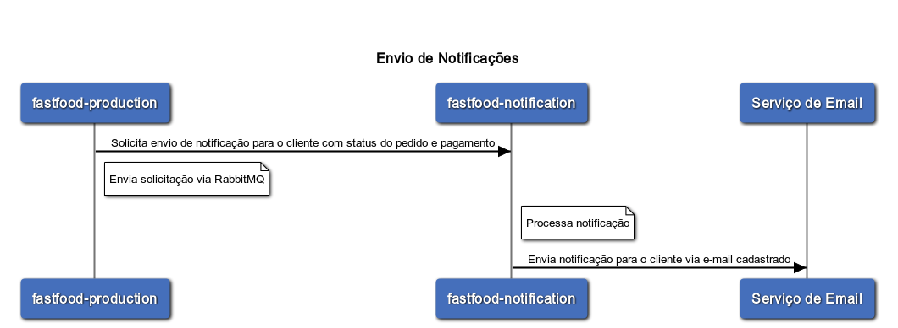

# fastfood-notification
Serviço responsável pelas notificações do fastfood
Envios de notificações (e-mails) para o cliente referente a alteração de status de pagamento.
Envios de notificações (e-mails) para o cliente referente a alteração de status de pedido.

 
 

#### **Fluxo Criação Pedido**

 

### [Tecnologias](#Tecnologias)
***
* Java
* Spring Boot
* Kubernetes
* Rabbit

 

### [Grupo 7](#grupo-7)
***
* Jackson Carlos Leite Ramalho
* Valqueline Nicácio da Silva

